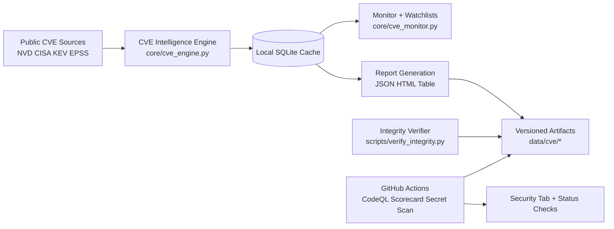

# FURY0s1nt Architecture

FURY0s1nt is organized as a research and intelligence pipeline where public-source data, local analysis, and report artifacts flow through controlled automation.

## System Flow

## Trust Controls

- Source integrity: checksums and verification tooling
- Automation quality: actionlint and timeout/concurrency guards
- Code security: CodeQL and Scorecard signals in Actions/Security tab
- Supply chain evidence: SBOM and release provenance attestations
- Governance: elevated review workflow for sensitive paths

## Design Principles

1. Verifiable outputs over broad claims.
2. Deterministic automation over ad hoc scripts.
3. Defensive research defaults over operational tradecraft defaults.
4. Fast contributor onboarding via reproducible demo paths.
